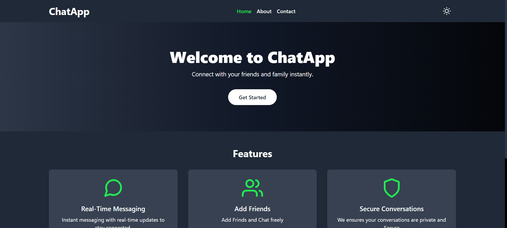
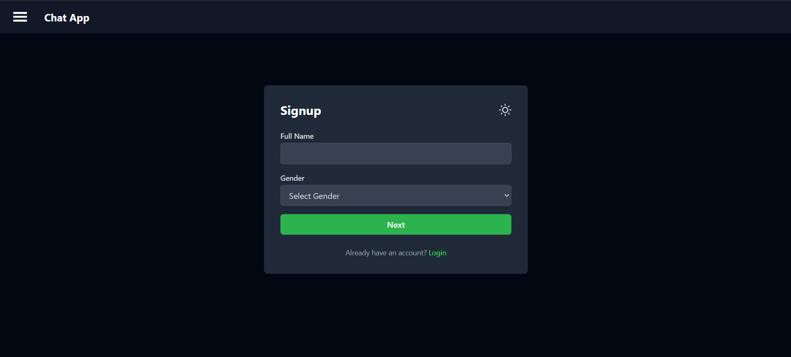
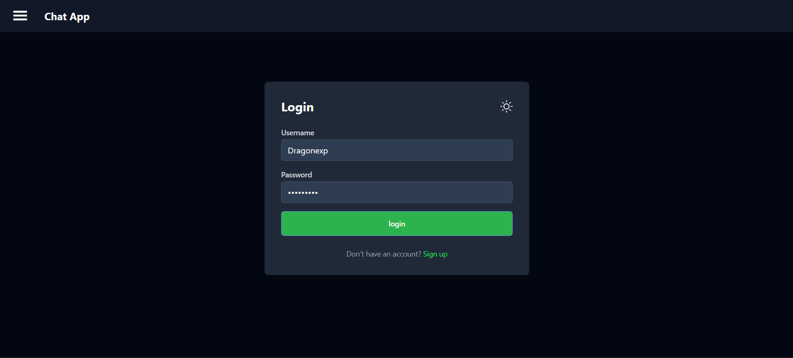
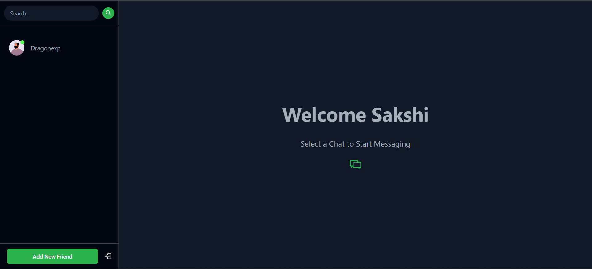
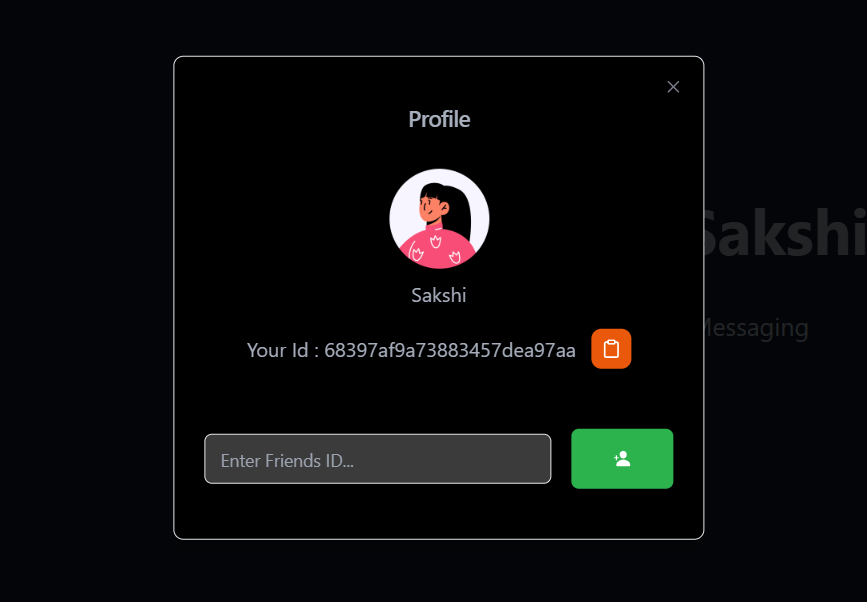
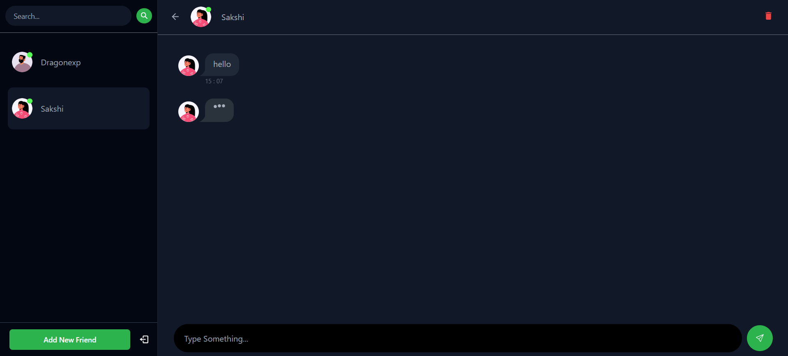
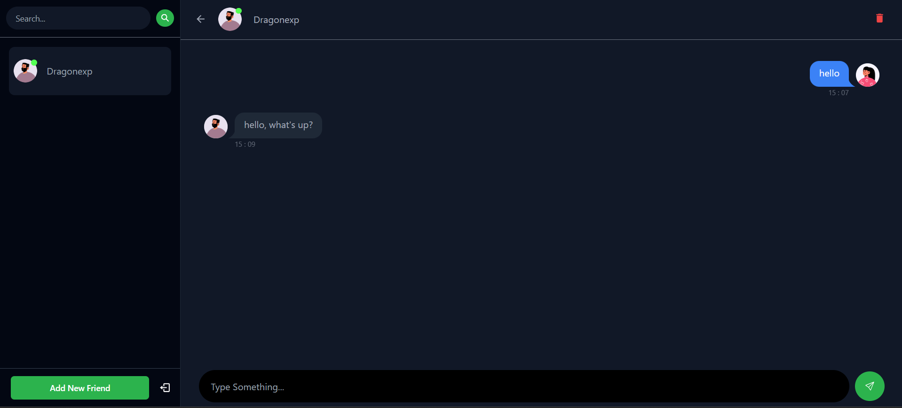
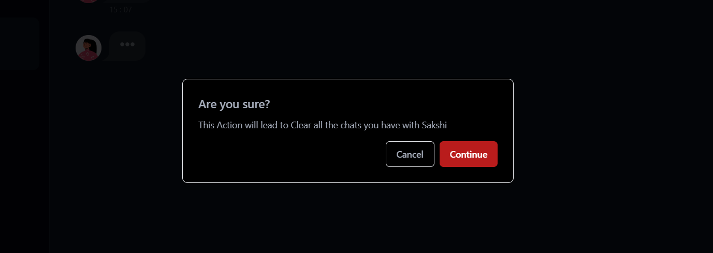

<!-- Technology Tags -->


# 💬 Chat App

A real-time chat application built using the MERN stack (MongoDB, Express, React, Node.js) and Socket.io. Users can register, login, and have real-time conversations with others in a modern, responsive interface.

---

## 📚 Table of Contents

- [📖 Introduction](#introduction)  
- [🛠 Tech Stack](#tech-stack)  
- [✨ Features](#features)  
- [📸 Demonstration](#demonstration)  
- [🚀 Project Start Guide](#project-start-guide)  
- [👨‍💻 Author](#author)  
- [🔗 Socials](#socials)

---

<a id="introduction"></a>
## 📖 Introduction

This is a full-stack chat application designed to offer a real-time messaging experience. It supports user authentication, live message updates using Socket.io, and a modern UI built with TailwindCSS. Designed to be scalable and fast, this chat app is ideal for practicing real-time communication systems and MERN stack development.

---

<a id="tech-stack"></a>
## 🛠 Tech Stack

**Frontend:**
- React.js
- TailwindCSS
- Axios
- React Router
- daisyui

**Backend:**
- Node.js
- Express.js
- MongoDB
- Socket.io
- bcryptjs & JWT (for authentication)

---

<a id="features"></a>
## ✨ Features

- 🔐 User registration and login
- 🧠 Secure password hashing (bcrypt)
- 🔄 Real-time messaging using Socket.io
- 📋 User list and online status indicator
- 💬 Chat history saved in MongoDB
- 💻 Responsive and modern UI with TailwindCSS
- 🌙 Dark mode support

---

<a id="demonstration"></a>
## 📸 Demonstration

### 1. Landing Page

### 2. Signup Page

### 3. Login Page  

### 4. Chat Page  

### 5. New Friend Model  

### 6. Message And Typing Indicator  

### 6. Final Preview   

### 7. Delete Chat Model


---

<a id="project-start-guide"></a>
## 🚀 Project Start Guide

### Prerequisites

- Node.js and npm installed
- MongoDB running locally or a cloud DB URI (e.g., MongoDB Atlas)

### Clone the repository

```bash
git clone https://github.com/your-username/chat-app.git
cd chat-app
```
### Backend setup
```bash
cd backend
npm i express mongoose cors jsonwebtoken bcryptjs cookie-parser
npm i nodemon -D
npm run server
```

### Frontend Setup
```bash
cd frontend
npm create vite@latest .
npm i react-router-dom react-icons axios 
npm run dev
```
### Tailwind Css Setup
```bash
npm install -D tailwindcss@3
npx tailwindcss init
```

### Environment Variables
Create a .env file inside the server/ directory with the following keys:
```.env
PORT=4000
MONGO_URI=your_mongodb_connection_string
JWT_SECRET=your_jwt_secret
```

<a id="author"></a>

### 👨‍💻 Author :
 - Omkar Chikhale
- omkarchikhale.dev@gmail.com 📧

<a id="socials"></a>

### 🔗 Socials
[](https://www.linkedin.com/in/omkar-chikhale/)  
[](https://twitter.com/your-username)  
[](https://www.instagram.com/om.kar816?igsh=MWd5dDF5bGd5ejFpMw==)  
[](https://www.facebook.com/profile.php?id=100087449895467&amp;mibextid=ZbWKwL)

> 
